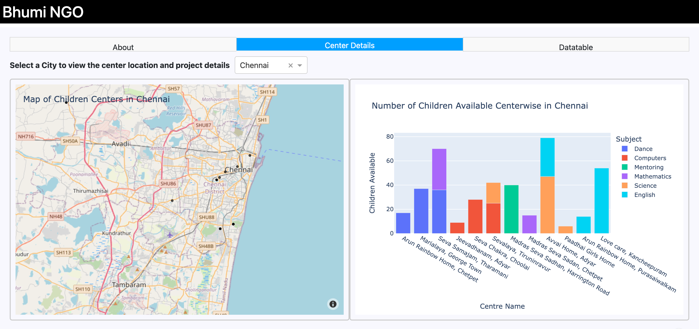

# BHUMI NGO

- Author:Revathy Ponnambalam

Dash App link : https://bhumi-yu8r.onrender.com/

## Dashboard Motivation: Why?

My dashboard is a dash app created for Bhumi NGO. Bhumi is a non-profit organization that focuses on providing education to underprivileged children in India. The organization has several programs that aim to improve the quality of education and create opportunities for children living in shelter homes, orphanages, and slums.

Ignite is one of Bhumi's programs that is focused on providing digital literacy and computer education to children in underprivileged communities. The program aims to bridge the digital divide and equip children with the skills they need to succeed in the 21st century.who has been teaching. 

## Dashboard Contents: What?

Upon launch of the Dash app, users are met with a detailed summary of Bhumi, the details of centers in each city in India. Users can toggle between three different tabs, showing different levels of summary information. The two tabs are described below. 

### Tab 1: About

### Tab 1: Center Details

> Users can explore different data filters using the filter pane on the top. These filters will update the main visuals on the page. Users can filter the centers based on city and the subjects taught in those centers. 

The summary visuals on page 1 are comprised of:

1. **Center Location Map:** Users can find individual centers on a map, and hover over each permit location to see an expanded list of information about the center details such as kids count, subjects taught in that center, number of volunteers available in that center.

2. **Children Available Chart:** Users can view the count of children in each center and also the number of children benefitted by the subject in each center.

3. **Volunteer Available Chart:** Users can view the count of children in each center and also the number of Volunteer available to teach kids by the subject in each center.

#### Example View:

### Tab 2: Datatable

> This is the Master data received from the Bhumi NGO.

#### Example View:

## Contribution to the Dashboard: How?

Interested in contributing to this dashboard? Instructions and guidelines for contributing to our project can be found in the `CONTRIBUTING.MD` file in this repository.

We are excited about this product, and welcome any suggestions for improvement. Specific suggestions about use-cases can help our team develop a truly useful app that people will use and build value from.

Thank you for considering contributing to our dashboard!

# License
Licensed under the terms of the MIT license.
